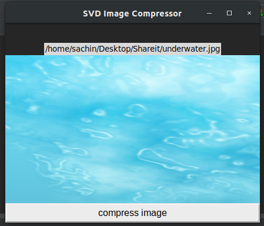

# FS-mini-project
Image compression using SVD
Singular Value Decomposition (SVD) of a matrix is a factorization of that matrix into three matrices. Singular Value Decomposition (SVD) is a widely used technique to decompose a matrix into several component matrices, exposing many of the useful and interesting properties of the original matrix. Using SVD, we can determine the rank of the matrix, quantify the sensitivity of a linear system to numerical error, or obtain an optimal lower-rank approximation to the matrix.

I have implemented SVD algorithm to compress the images in Python language. I have also created simple, basic GUI using Tkinter in Python.

Requirements to run the code:
1. Python 3.6. 
2. Tkinter.
3. NumPy.

How to use the code:
1. Clone the files into your system.
2. Import Numpy, Tkinter packages.
3. Open the GUI.py code in any editor.
4. Run GUI.py.
5. Press the '+' button to open the file directory.
6. Choose the image. 
7. Verify the image and path.
8. Click compress button.
9. Save the compressed file in desired location.
10. Check the console for additional information.

Graphical User Interface(GUI):

Main Screen -

Choosing the image -

Verify the image in the GUI -

Then you get the compressed image. 
Please read the FS_report.pdf for full information.
